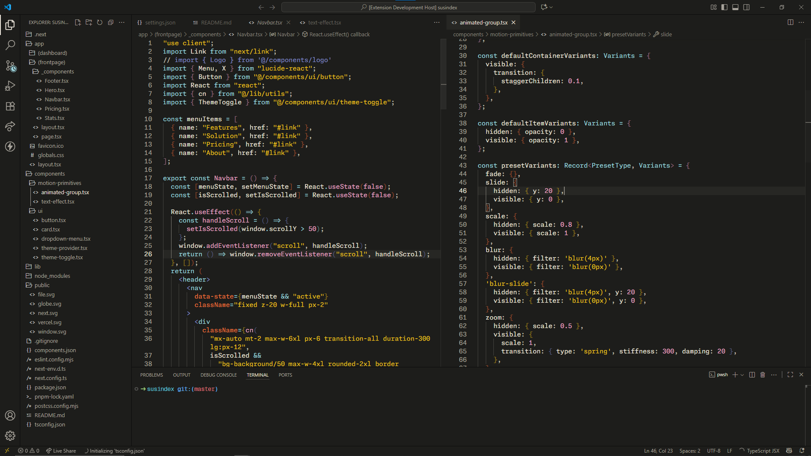

# codepedia dark theme

### dark theme for rest your eye and enjoyed for time you coding



`font : Monaspace`
`icon : Chalice Icon Theme`

we are in develope this theme if you want sent **PR** to **project** **repository**


## Color Palette
```
#0b0b0b
#141413
#1d1d1b
#3f3e3b
#615f5b
#84817a
#a6a29a
#c8c3ba
#eae4da
#c63f3e
#ed773c
#9ed6df
#eaa7c7
#808bc5
#245e55
#eac119
```